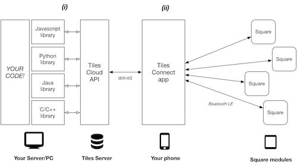

# Tiles Toolkit 

Tiles is a inventor toolbox to support the design and making of interactive objects for learning and play. Tiles allows non-experts to create complex and distributed physical interfaces. For more information (tilestoolkit.io)[http://tilestoolkit.io]

Tiles allows rapid development of technology-augmented everyday objects (the so-called Internet of Things).

## Fundamentals

Tiles is centered on the concept of *Interaction Primitives*, a set of simple interaction events between technology-augmented objects and humans. *Input primitives* consist in physical objects manipulation like tapping, rotate or shake. *Output primitves* are a set of feedbacks such as LED lights, haptic and sound.

(Interaction Primitive)[imgs/primitives.png]

In order to enable everyday objects to become interactive and support interaction primitives we developed *Squares* tiny computers that can be easily sticked anywhere. Square capture input primitives and produce output primitives.

(Squares modules)[imgs/squares.png]

In order to build applications that make use of interaction primitives captured/produced by square modules within your application we developed a set of software tools called TDT.

## Tiles Development Tools (TDT) v.01

TO BE CONTINUED