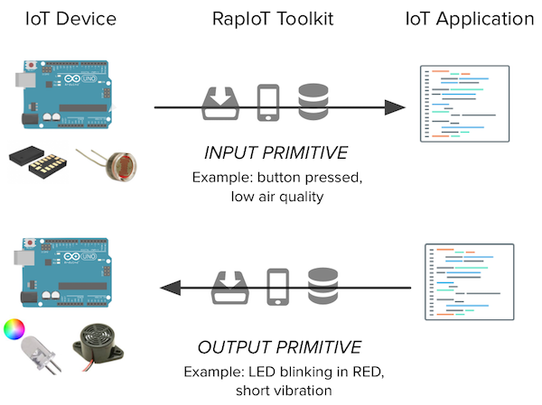
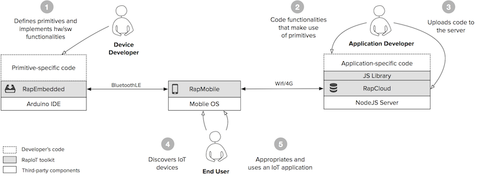

# Tiles gateway

## Setting up project environment
To set up the project, clone the repository and install the required global npm packages:
`$ npm install -g angular-cli ionic cordova tslint`
Install the local npm packages with
`$ yarn install`
or
`$ npm install`

## Running the app
### Browser
The app runs using either npm commands or the ionic cli. To run the app in the browser (mind that the browser does not have support for cordova, so the BLE results will be mock data) use
`$ ionic serve -l`
This will open up a browser window with the possibility to view the app on IOS, Android and Windows phone.

### On a device
To run the app on a device you have to have android studio for android or xcode and a mac for IOS.
Install the cordova platform for your device with the command
`$ ionic platform add <platform>`
where platform is either ios or android. Other platforms are also available, but we are not focusing on making the app work on these.
Connect your phone to the computer by the usb cord and run
`$ ionic run <platform>`
This should open the app on your phone.
You can also add the -l flag to trigger hot reloading, but this has been known to cause some problems from Ionic's side.
NB! Note that apple is strict when it comes to accessing the native components of the phone, so many of the native components of the code, amongst them the BLE will not work. You can circumvent this by using the [Ionic view](http://view.ionic.io/) app instead, following [this guide](https://docs.ionic.io/tools/view/).

### Problems
When using `$ ionic serve` or `$ ionic run <platform> -l` you might run into troubles with the API not working. This is because of CORS and can be solved by using only `$ ionic run <platform>` without the live reloading for running it on a simulator/mobile or by downloading the chrome extension [Allow-Control-Allow-Origin: *](https://chrome.google.com/webstore/detail/allow-control-allow-origi/nlfbmbojpeacfghkpbjhddihlkkiljbi) for the browser.

## Building an andoid apk
To create a version of the application, use `$ ionic build android`. This will create a debug apk, which will work with all the same functionality of a production app, but takes a bit more space than a production app. 

## Before making a pull request
We are using travis as a tool for CI to make sure the contributing code does not break any tests and is linted according to the linting rules. Before making a pull request check that these are ok by running the commands:
`$ npm test`
and
`$ npm run lint`

# RapIoT Toolkit (Partial description)

RapIoT is a software platform for simple programming of ecologies of IoT devices and services. It builds on top of IoT-enabling technologies such as MQTT, CoAP and BTLE.

RapIoT is part of *Tiles*, an inventor toolbox to support the design and making of interactive objects for learning and play. For more information [tilestoolkit.io](http://tilestoolkit.io)

For furter references and details please read:
S.Mora, F. Gianni and M.Divitini. “RapIoT Toolkit: Rapid Prototyping of Collaborative Internet of Things Applications”. In proceedings of the International Conference on Collaboration Technologies and Systems (CTS), 2016. [preprint](https://dl.dropboxusercontent.com/u/4495822/Papers/Papers/2016_RapIoT.pdf)

RapIoT is released under [Apache 2.0 license](https://tldrlegal.com/license/apache-license-2.0-(apache-2.0)).

# RapIoT Fundamentals

## Data Primitives

RapIoT enables the definition, implementation and manipulation of *data type primitives*. RapIoT's primitives allow to abstract low-level implemenetation details and provide a loosely-coupled interface between different achitectural layers. Data types primitives facilitate the development of IoT architectures in mulpliple ways:

- Act as a loosely coupled interface between devices and applications, allowing devices to serve different applications without need for reprogramming their firmware

- Allow for centralising the application login in the cloud layer, offering a platform as a service and simplifying the development of systems that make use of ecologies of devices distribuited to multiple users/environments

- Facilitate collaboration among developers working on different IoT layers by providing simple constructs to be used to describe the data exchanged between embedded devices and applications

- Allow non-experts to think in terms of high-level abstractions without dealing with hardware complexities. For example data from an accelerometer describing an object's manipulation can be provided as “isShaken, isRotatedClockwise, isTouched” programming primitives rather than raw accelerometer data.

Example of data primitives are:

*Input primitives* a discrete information sensed by an IoT device; for example a data-point captured by a sensor or a manipulation performed via a user interface

*Output primitves* an action that can be performed by the IoT device via output features such as actuators or displays, for example a motor spinning or a LED (Light Emitting Diode) blinking

## Architecture 

RapIoT composed by:
* *RapEmbedded:* an Arduino library to support definition and implementation of input and output primitives on embedded hardware devices;
* *RapMobile:* a cross-platform mobile app that acts as internet gateway and allows to discover and configure IoT devices;
* *RapCloud:* a cloud service, real-time APIs and javascript library that support the development of applications that interact with IoT devices.

### RapEmbedded

TBD

### RapMobile

RapMobile is a software application for smartphones that wirelessly connects IoT devices to your application via RapCloud. This is required for the interaction primitives to be captured and exchanged between the Square modules and your application. 

To setup RapMobile on your smartphone (Android or iPhone) follow [these instructions](./MOBILE). 

### RapCloud

RapCloud provides a centralized, software interface to interact with ecologies Arduino-based IoT devices. It allows developers that are not specialized in writing code for embedded devices to create applications using simple javascript instructions. Functionalities provided by multiple devices can be programmed from routines running in a centralized cloud environment; without requiring physical access to the hardware modules. 

A RapIoT test server is provided at http://138.68.144.206 with administrator interface at http://admin.tilestoolkit.io
If you want to setup your own RapCloud server follow [these instructions](./CLOUD)

#### Javascript library and APIs

TBD

# Build your first Rap Application (TBD)

### STEP 1

Build your IoT device with Arduino and RapEmbedded. As an alternative you can use RapIoT-ready IoT devices called Tiles Squares.

### STEP 2 

Open the RapMobile app on your smartphone. This is how it looks like.

1. Tap on “Click to connect to server” 
2. Type in your  username. If you don’t have one it will be automatically created. OPTIONAL: If you have a custom RapIoT server type the address here, otherwise leave the default server.
3. Connect to one or more square modules
4. Leave the Tiles connect app open on your phone

### STEP 3

Write some code in javascript usint the provided libray TBD.