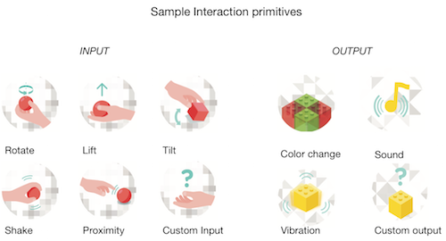

# Tiles Toolkit 

Tiles is a inventor toolbox to support the design and making of interactive objects for learning and play. Tiles allows non-experts to create complex and distributed physical interfaces. For more information [tilestoolkit.io](http://tilestoolkit.io)

Tiles allows rapid development of technology-augmented everyday objects (the so-called Internet of Things).

## Fundamentals

Tiles is centered on the concept of 

*Interaction Primitives*, a set of simple interaction events between technology-augmented objects and humans. 

*Input primitives* consist in physical objects manipulation like tapping, rotate or shake. 

*Output primitves* are a set of feedbacks such as LED lights, haptic and sound.

### Squares Modules

In order to enable everyday objects to become interactive and support interaction primitives we developed *Squares* tiny computers that can be easily sticked anywhere. Square capture input primitives and produce output primitives.

In order to build applications that make use of interaction primitives captured/produced by square modules within your application we developed a set of software tools called TDT.

## Tiles Development Tools (TDT) v.01

TDT provides a development environment to facilitate the development of software that make use of sequences of interaction events to implement specific application logic. TDT is composed by 
- **Tiles Cloud** is a cloud infrastructure, real-time APIs and software libraries to enable development and integration of Tile-based interfaces with software applications
- **Tiles Connect** a smartphone app for discovery and administration of quare modules 
- **Tiles Libraries** to write tiles application within your favourite development environment.

### Tiles Cloud (TC)

Tiles Cloud (TC) provides a centralized, language-agnostic software interface to interact with ecologies of Square modules. It allows developers that are not specialized in writing code for embedded devices to create applications using commonly known languages and tools. Functionalities provided by multiple Square modules attached to several objects, and thus the behaviour of the augmented objects, can be programmed from routines running in a centralized cloud environment; without requiring physical access to the hardware modules. 

A TC server is provided at http://cloud.tilestoolkit.io with administrator interface at http://cloud.tilestoolkit.io:3000
If you want to setup your own Tiles Cloud server follow [these instructions](https://github.com/simonem/tiles-dev-sw/tree/master/Tiles%20CLOUD/api-server)

### Tiles Connect (TCON)

Tiles connect (TCON) is a software application for smartphones that wirelessly connects Square modules to your application via the TAPI. This is required for the interaction primitives to be captured and exchanged between the Square modules and your application. 

To setup TCON on your smartphone (Android or iPhone) follow [these instructions](https://github.com/simonem/tiles-dev-sw/tree/master/Tiles%20MOBILE). TCON will be soon distributed for beta testing.

### Tiles Libraries (TL)

Tiles libraries (TL)enable development of Tiles application. It provides functionalities to connect to TC, send output primitive commands to specific square modules as well as handling input primitives events from the modules.

TL are provided for python(v00), C++(v00), Java(v00) and Javascript(v01)
